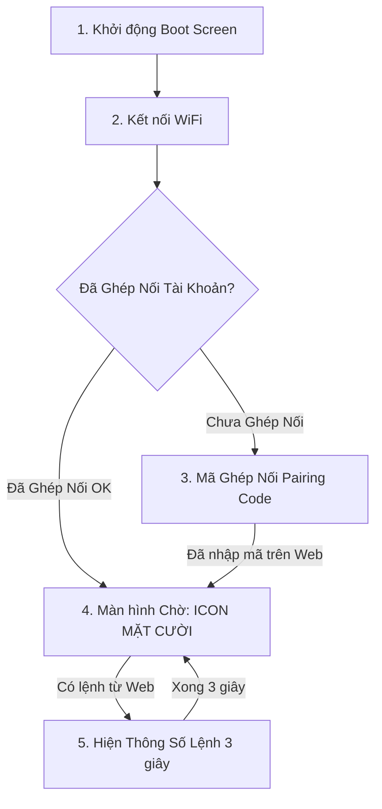

## 1. Tổng Quan Kiến Trúc Tối Giản (Minimalist UX)

Hệ thống hiển thị OLED được thiết kế theo phong cách **Tối giản - Thẩm mỹ - Dễ thương**:
* **Trạng thái Thường trực (Standby):** Màn hình hiển thị **Icon Mặt Cười / Robot Dễ Thương** biểu thị thiết bị hoạt động tốt và sẵn sàng nhận lệnh.
* **Trạng thái Thực thi (Active Event):** Khi nhận lệnh từ Web (Bật/tắt, đổi nhiệt độ, học IR), màn hình sẽ bật sáng hiển thị thông số lệnh trong **3 giây**, sau đó **tự động quay trở lại màn hình Icon Mặt Cười**.

---

## 2. Sơ Đồ Luồng Hiển Thị Tuần Tự (Screen Flow)



---

## 3. Chi Tiết Các Màn Hình Hiển Thị

### 3.1. Màn hình 1: Khởi động hệ thống (Boot Screen)
* **Thời gian:** 2 giây đầu khi cắm nguồn.

```text
+-----------------------------------+
| ================================= |
|          AC REMOTE HUB            |
|             v0.1.0                |
| ================================= |
|     Dang khoi dong he thong...    |
+-----------------------------------+
```

---

### 3.2. Màn hình 2: Kết nối WiFi (WiFi Connecting)
* **Trạng thái:** ESP32 đang thử kết nối tới WiFi nhà.

```text
+-----------------------------------+
|  WiFi: Dang ket noi...            |
|                                   |
|         |
|                                   |
|  Vui long cho trong giay lay...   |
+-----------------------------------+
```

---

### 3.3. Màn hình 3: Hiện Mã Ghép Nối (Pairing Code Screen)
* **Trạng thái:** Xuất hiện khi WiFi đã OK nhưng thiết bị **chưa được gán vào tài khoản nào**.

```text
+-----------------------------------+
| WiFi: OK  |  Cloud: Online        |
| --------------------------------- |
| MA GHEP NOI WEB (PAIRING CODE):   |
|            > 582 914 <            |
| --------------------------------- |
| Nhap ma tren Web de kich hoat     |
+-----------------------------------+
```

---

### 3.4. Màn hình 4: Màn Hình Chờ Icon Mặt Cười (Default Idle / Mascot Screen)
* **Trạng thái:** Màn hình mặc định thường trực khi hệ thống chạy bình thường.

```text
+-----------------------------------+
| WiFi: -58dBm       | Cloud: [ON]  |
| --------------------------------- |
|                                   |
|            ( ^ _ ^ )              |
|          READY / STANDBY          |
|                                   |
+-----------------------------------+
```
* **Đặc điểm:** 
  * Thanh trên cùng hiển thị tín hiệu WiFi & Cloud.
  * Ở giữa là **Biểu tượng Mặt Cười Dễ Thương** (có thể nháy mắt / hoạt hình nhẹ) biểu thị thiết bị sẵn sàng.

---

### 3.5. Màn hình 5: Nhận Lệnh & Thực Thi (Command Event Screen)
* **Trạng thái:** Tự động hiện lên khi người dùng gửi bất kỳ lệnh nào từ Web (Bật/Tắt, đổi nhiệt độ, đổi chế độ...).
* **Thời gian hiển thị:** **3 giây**, sau đó **tự động trở về Màn hình 4 (Mặt cười)**.

```text
+-----------------------------------+
| >>> NHAN LENH DIEU KHIEN <<<      |
| --------------------------------- |
| Nguon   : BAT                     |
| Nhiet do: 26°C -> 24°C            |
| Che do  : COOL                    |
| [Phat IR... Thanh Cong ✅]        |
+-----------------------------------+
```

---

### 3.6. Màn hình 6: Chế độ Học Remote Gốc (IR Learning Mode)
* **Trạng thái:** Xuất hiện khi người dùng bật chế độ "Học Lệnh Remote" trên Web.

```text
+-----------------------------------+
| 📡 DANG HOC REMOTE GOC            |
| --------------------------------- |
| Chia remote goc vao mat doc       |
| va BAM NUT CAN HOC!               |
| Dem nguoc: 30s...                 |
+-----------------------------------+
```
* Khi học xong thành công $\rightarrow$ Hiện thông báo `🎉 HỌC THÀNH CÔNG!` trong **3 giây** rồi quay về Màn hình Mặt Cười.

---
