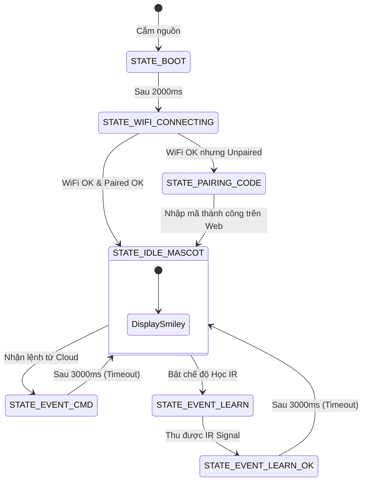

Bộ phận Firmware cần triển khai hiển thị theo mô hình **FSM phi bất đồng bộ (Non-blocking)**, tuyệt đối **KHÔNG sử dụng hàm `delay()`** gây ảnh hưởng đến luồng nhận lệnh Cloud/IR.



---

## 3. MÔ TẢ CHI TIẾT CÁC TRẠNG THÁI HIỂN THỊ (SCREEN LAYOUTS)

### 3.1. Trạng Thái 1: `STATE_BOOT` (Khởi Động)
* **Điều kiện kích hoạt:** Khi cấp nguồn cho ESP32.
* **Thời gian hiển thị:** Đúng 2000ms.
* **Layout:**
```text
+-----------------------------------+ (128x64)
| ================================= | Line 0
|          AC REMOTE HUB            | Line 16
|             v0.1.0                | Line 32
| ================================= | Line 48
|     Khoi dong he thong...         | Line 56
+-----------------------------------+
```

---

### 3.2. Trạng Thái 2: `STATE_WIFI_CONNECTING` (Kết Nối WiFi)
* **Điều kiện kích hoạt:** Đang thực hiện `WiFi.begin()`.
* **Layout:**
```text
+-----------------------------------+
| WiFi: Dang ket noi...             |
|                                   |
|       [ CONNECTING... ]           |
|                                   |
| Vui long cho trong giay le...     |
+-----------------------------------+
```

---

### 3.3. Trạng Thái 3: `STATE_PAIRING_CODE` (Hiển Thị Mã Ghép Nối)
* **Điều kiện kích hoạt:** WiFi kết nối thành công, Server trả về `paired == false` và cấp mã `pairingCode`.
* **Dữ liệu động:** Biến `char pairingCode[7]` (Ví dụ: `"582914"`).
* **Layout:**
```text
+-----------------------------------+
| WiFi: OK  |  Cloud: Online        |
| --------------------------------- |
| MA GHEP NOI WEB (PAIRING CODE):   |
|                                   |
|            > ID 6 số <            | (Font Size 2)
|                                   |
| Nhap ma tren Web de kich hoat     |
+-----------------------------------+
```

---

### 3.4. Trạng Thái 4: `STATE_IDLE_MASCOT` (Màn Hình Chờ Mặc Định - Icon Mặt Cười)
* **Điều kiện kích hoạt:** Thiết bị đã Pair thành công và ở trạng thái rảnh.
* **Dữ liệu động:** Biến `int rssi` (Cường độ WiFi), `bool cloudConnected`.
* **Layout:**
```text
+-----------------------------------+
| WiFi: -58dBm       | Cloud: [ON]  |
| --------------------------------- |
|                                   |
|            ( ^ _ ^ )              | (Font Size 2, Căn giữa)
|          READY / STANDBY          | (Font Size 1, Căn giữa)
|                                   |
+-----------------------------------+
```

---

### 3.5. Trạng Thái 5: `STATE_EVENT_CMD` (Nhận Lệnh Điều Khiển)
* **Điều kiện kích hoạt:** Nhận payload từ Web API `/commands/next`.
* **Thời gian hiển thị:** 3000ms. Sau 3000ms tự chuyển về `STATE_IDLE_MASCOT`.
* **Dữ liệu động:** 
  * `bool power` (Bật/Tắt)
  * `int temp` (Nhiệt độ mới, ví dụ `24`)
  * `char mode[]` (Chế độ, ví dụ `"COOL"`)
* **Layout:**
```text
+-----------------------------------+
| >>> NHAN LENH DIEU KHIEN <<<      |
| --------------------------------- |
| TRANG THAI : BAT                  |
| NHIET DO   : 24°C                 |
| CHE DO     : COOL                 |
| [Phat tin hieu IR... OK]          |
+-----------------------------------+
```

---

### 3.6. Trạng Thái 6 & 7: `STATE_EVENT_LEARN` & `STATE_EVENT_LEARN_OK` (Học IR)
* **STATE_EVENT_LEARN:** Hiện khi đang đợi người dùng bấm remote gốc (Đếm ngược 45s).
* **STATE_EVENT_LEARN_OK:** Hiện kết quả học thành công trong 3000ms rồi quay về `STATE_IDLE_MASCOT`.

```text
+-----------------------------------+
| 📡 DANG HOC REMOTE GOC            |
| --------------------------------- |
| Chia remote vao mat doc           |
| va BAM NUT CAN HOC!               |
| Dem nguoc: 35s...                 |
+-----------------------------------+
```

---


## 5. TIÊU CHUẨN KIỂM THỬ (ACCEPTANCE CRITERIA FOR QA)

1. **Khởi động:** Màn hình BOOT xuất hiện không quá 2 giây, sau đó chuyển sang CONNECTING.
2. **Ghép nối:** Nếu thiết bị chưa ghép nối, mã 6 số phải hiển thị to ở giữa màn hình.
3. **Màn hình chờ:** Khi kết nối xong, màn hình phải hiển thị biểu tượng mặt cười `( ^ _ ^ )` kèm trạng thái WiFi/Cloud.
4. **Nhận lệnh:** Khi ấn nút trên Web App, màn hình phải lập tức sáng và đổi sang trạng thái `>>> NHAN LENH WEB <<<`, sau đúng **3.0 giây** phải tự động trả về màn hình mặt cười `( ^ _ ^ )`.
5. **Không đơ treo (Non-blocking):** Màn hình cập nhật liên tục mà không gây trễ tín hiệu phát hồng ngoại IR (dưới 100ms).
